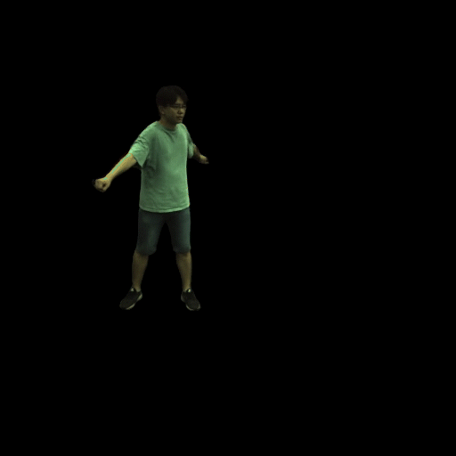

# DyMap: Representing Volumetric Videos as Dynamic MLP Maps

### [Project Page](https://zju3dv.github.io/dymap) | [Video](https://www.youtube.com/watch?v=8GjEew-iIOo) | [Paper](https://zjueducn-my.sharepoint.com/:b:/g/personal/pengsida_zju_edu_cn/EZnHPFkQk-hFoFsHps47uxIBTM0F1uuaPBd2sCVfZZ92iA?e=NuaV0M) | [Data](INSTALL.md#zju-mocap-dataset)


> [DyMap: Representing Volumetric Videos as Dynamic MLP Maps](https://zjueducn-my.sharepoint.com/:b:/g/personal/pengsida_zju_edu_cn/EZnHPFkQk-hFoFsHps47uxIBTM0F1uuaPBd2sCVfZZ92iA?e=NuaV0M)  
> Sida Peng*, Yunzhi Yan*, Qing Shuai, Hujun Bao, Xiaowei Zhou (* equal contribution)  
> CVPR 2023

Any questions or discussions are welcomed!

## Installation

Please see [INSTALL.md](INSTALL.md) for manual installation.

## Interactive demo

 <details> <summary>Interactive rendering on ZJU-MoCap</summary>

Please see [INSTALL.md](INSTALL.md) to download the dataset. We provide the pretrained models at [here](https://zjueducn-my.sharepoint.com/:f:/g/personal/pengsida_zju_edu_cn/EmUQZOYYfRZBiQ6xGpcP1dwBBCrwuB3LjnOKcPsbf4Vfew?e=9CTu4u).

Take the rendering on `sequence 313` as an example.

1. Download the corresponding pretrained model and put it to `$ROOT/data/trained_model/zjumocap/313/final.pth`.

2. Interactive rendering demo:
    ```
    python gui.py --config configs/zjumocap/dymap_313.py fast_render True 
    ```
</details>

 <details> <summary>Interactive rendering on NHR</summary>

Please see [INSTALL.md](INSTALL.md) to download the dataset. We provide the pretrained models at [here](https://zjueducn-my.sharepoint.com/:f:/g/personal/pengsida_zju_edu_cn/EmUQZOYYfRZBiQ6xGpcP1dwBBCrwuB3LjnOKcPsbf4Vfew?e=9CTu4u).

Take the rendering on `sequence sport1` as an example.

1. Download the corresponding pretrained model and put it to `$ROOT/data/trained_model/nhr/sport1/final.pth`.

2. Interactive rendering demo:
    ```
    python gui.py --config configs/nhr/sport1.py fast_render True 
    ```
</details>

## Run the code on ZJU-MoCap

Please see [INSTALL.md](INSTALL.md) to download the dataset.

We provide the pretrained models at [here](https://zjueducn-my.sharepoint.com/:f:/g/personal/pengsida_zju_edu_cn/EmUQZOYYfRZBiQ6xGpcP1dwBBCrwuB3LjnOKcPsbf4Vfew?e=9CTu4u).

 <details> <summary>Test on ZJU-MoCap</summary>

Take the test on `sequence 313` as an example.

1. Download the corresponding pretrained model and put it to `$ROOT/data/trained_model/zjumocap/313/final.pth`.

2. Test on unseen views:
    ```
    python run.py --config configs/zjumocap/dymap_313.py mode evaluate fast_render True
    ```
</details>

<details> <summary>Visualization on ZJU-MoCap</summary>

Take the visualization on `sequence 313` as an example.

1. Download the corresponding pretrained model and put it to `$ROOT/data/trained_model/zjumocap/313`.

2. Visualization:
    * Visualize free-viewpoint videos
    ```
    python run.py --config configs/zjumocap/dymap_313.py mode visualize vis_novel_view True fast_render True
    ```
    


    * Visualize novel views of single frame
    ```
    python run.py --config configs/zjumocap/dymap_313.py mode visualize vis_novel_view True fixed_time True fast_render True
    ```
    

    * Visualize the dynamic scene with fixed camera
    ```
    python run.py --config configs/zjumocap/dymap_313.py mode visualize vis_novel_view True fixed_view True fast_render True
    ```
    

</details>

 <details> <summary>Training on ZJU-MoCap</summary>

Take the training on `sequence 313` as an example.

1. Train:
    ```
    # training
    python train_net.py --config configs/zjumocap/dymap_313.py
    # distributed training
    python -m torch.distributed.launch --nproc_per_node=4 train_net.py --config configs/zjumocap/dymap_313.py
    ```
2. Post-process the trained model:
    ```
    python run.py --config configs/zjumocap/dymap_313.py mode visualize occ_grid True
    ```
3. Tensorboard:
    ```
    tensorboard --logdir data/record/zjumocap
    ```
</details>

## Run the code on NHR
Please see [INSTALL.md](INSTALL.md) to download the dataset.

We provide the pretrained models at [here](https://zjueducn-my.sharepoint.com/:f:/g/personal/pengsida_zju_edu_cn/EmUQZOYYfRZBiQ6xGpcP1dwBBCrwuB3LjnOKcPsbf4Vfew?e=9CTu4u).

 <details> <summary>Test on NHR</summary>

Take the test on `sequence sport1` as an example.

1. Download the corresponding pretrained model and put it to `$ROOT/data/trained_model/nhr/sport1/final.pth`.

2. Test on unseen views:
    ```
    python run.py --config configs/nhr/sport1.py mode evaluate fast_render True
    ```
</details>

<details> <summary>Visualization on NHR</summary>

Take the visualization on `sequence sport1` as an example.

1. Download the corresponding pretrained model and put it to `$ROOT/data/trained_model/nhr/sport1`.

2. Visualization:
    * Visualize novel views
    ```
    python run.py --config configs/nhr/sport1.py mode visualize vis_novel_view True fast_render True
    ```
    

    * Visualize novel views of single frame
    ```
    python run.py --config configs/nhr/sport1.py mode visualize vis_novel_view True fixed_time True fast_render True
    ```
    

    * Visualize the dynamic scene with fixed camera
    ```
    python run.py --config configs/nhr/sport1.py mode visualize vis_novel_view True fixed_view True fast_render True
    ```
    

</details>

<details> <summary>Training on NHR</summary>

Take the training on `sequence sport1` as an example.

1. Train:
    ```
    # training
    python train_net.py --config configs/nhr/sport1.py
    # distributed training
    python -m torch.distributed.launch --nproc_per_node=4 train_net.py --config configs/nhr/sport1.py
    ```
2. Post-process the trained model:
    ```
    python run.py --config configs/nhr/sport1.py mode visualize occ_grid True
    ```
3. Tensorboard:
    ```
    tensorboard --logdir data/record/nhr
    ```
</details>


## Citation

If you find this code useful for your research, please use the following BibTeX entry.

```
@inproceedings{peng2023dymap,
  title={Representing Volumetric Videos as Dynamic MLP Maps},
  author={Peng, Sida and Yan, Yunzhi and Shuai, Qing and Bao, Hujun and Zhou, Xiaowei},
  booktitle={CVPR},
  year={2023}
}
```
